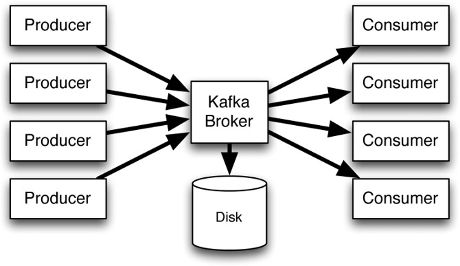
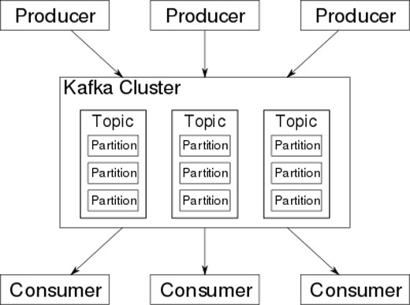
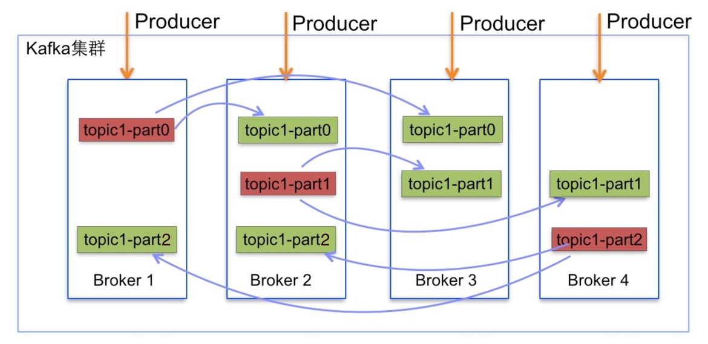
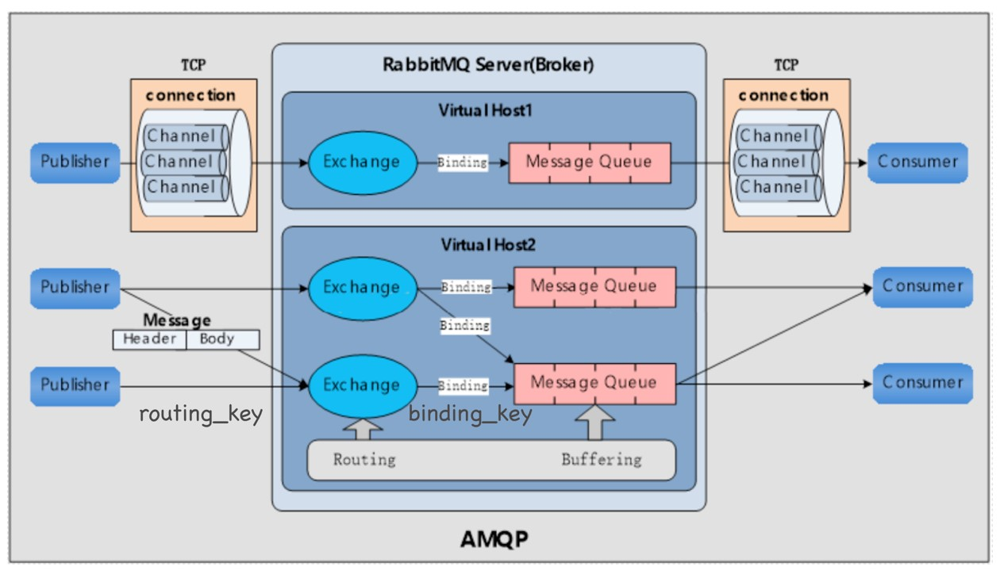

### ActiveMQ
[官方文档](http://activemq.apache.org/cross-language-clients.html)  


### Kafka
- 工作原理
1. broker  

2. topic  

3. partition  

- 版本
1. Apache Kafka
2. [Confluent Platform](https://www.confluent.io/product/compare/)

- 客户端工具
    1. Apache Kafka的Python客户端：kafka-python
    2. Confluent kafka的Python客户端： confluent-kafka-python
        - [github地址](https://github.com/confluentinc/confluent-kafka-python)
        - [官方文档](https://docs.confluent.io/current/clients/confluent-kafka-python/index.html#consumer)
    
- Docker镜像  
[Confluent kafka 的docker镜像](https://github.com/confluentinc/cp-docker-images)

3. 运行并且使用kafka
    1. 运行服务器
    ```shell script
    cd kafka/kafka-single-node
    docker-compose -f docker-compose.yml up -d   # 启动
    docker-compose -f docker-compose.yml down    # 关闭
    ```
    > 启动了防火墙需要开放相应端口
    2. 安装客户端
        - [安装必要依赖librdkafka](https://github.com/edenhill/librdkafka)
        - 安装confluent-kafka-python  
            `pip install confluent-kafka -i https://pypi.douban.com/simple`
4. kafka的几个使用需要注意的特征
    - 分区之间是无序的，但分区内的消息是有序的
    - 对于topic的消费，消费者的数量 应不多于 该topic分区的数量，否则多余的消费者将必定无法接收到消息
        > 当消费者服务启动后，会与所消耗的分区绑定，后启动的服务就不能消费该分区的数据，形成排他现象
    - 一个消费者可同时消费多个topic
    - 在订阅消费时`c.subscribe()`，Kafka保证每条消息在同一个Consumer Group里只会被某一个Consumer消费(应用：正式打包上线前应该使用新的group.id，以便于从kafka最新的位置开始消费，即从测试组切换为生产组)


### RabbitMQ
- 工作原理


- 基于docker安装RabbitMQ
    - [RabbitMQ的docker镜像](https://github.com/docker-library/docs/tree/master/rabbitmq)
    - `docker run -d --hostname my-rabbit --name some-rabbit -p 5672:5672 rabbitmq:alpine`
    
- RabbitMQ的Python客户端：pika
    - [Github地址](https://github.com/pika/pika)
    - [使用文档](https://pika.readthedocs.io/en/0.10.0/examples.html)
 
- 使用的一些重要概念
- queue常用属性
    - durable：表示持久化队列，rabbitmq服务重启后队列不丢失
    - exclusive：表示队列是否对当前连接特有，其它连接不能使用，当前连接断开后队列会消失。exclusive和durable是互斥的
    - auto_delete：表示当消费者不再使用队列使用时会自动删除
- 消费者的Ack确认机制(可类比为TCP三次握手四次挥手中的ack信号)
- routing_key与binding_key
- Exchange常用属性(durable、auto_delete)及其类型
    - 直连交换机：direct转发消息到RK指定的队列(BK严格匹配RK) 
    - 扇形交换机：fanout 转发消息到所有绑定队列
    - 主题交换机：topic按RK规则转发(BK模糊匹配RK)
    - 首部交换机：headers根据发送消息中的headers属性进行匹配 
    
### RocketMQ
- [基于docker安装RocketMQ](https://github.com/apache/rocketmq-externals)
- RocketMQ的python客户端rocketmq-client-python：`pip install rocketmq-client-python`


 

### 参考
- kafka配置文件
    - https://blog.csdn.net/Dream_Flying_BJ/article/details/73188662
    - https://www.jianshu.com/p/b9a8f20b0af6
    
- Docker pull镜像慢的解决方法
    1. 修改或新建文件
    ```
    sudo vim /etc/docker/daemon.json
    ```
    2. 添加以下配置
    ```
    {
       "registry-mirrors" : [
            "https://registry.docker-cn.com",       
            "https://docker.mirrors.ustc.edu.cn",   # 中国科技大学的docker镜像源
            "https://9cpn8tt6.mirror.aliyuncs.com"  # 阿里docker镜像源
        ]
    }
    ```
    3. 加载配配置并重启服务
    ```
    # 使配置文件生效
    systemctl daemon-reload
    
    # 重启docker
    systemctl restart docker
    ```
- make install安装到指定虚拟环境
```
sudo make install DESTDIR='/home/willi/.virtualenvs/dev/lib/python3.5/site-packages'
```
- [WebSocket和Stomp协议](https://www.jianshu.com/p/db21502518b9)
- [基于 Docker 安装 RocketMQ](https://www.jianshu.com/p/706588323276)
- [Rocketmq原理&最佳实践](https://www.jianshu.com/p/2838890f3284)